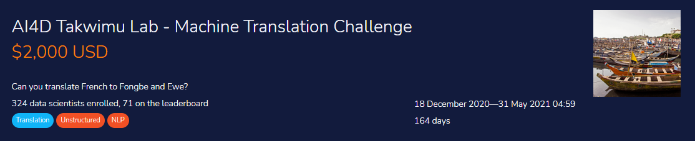
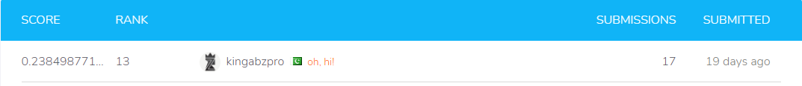

 # Machine translation using `simpletransformers` *French to Fongbe and Ewe*

Ewe and Fongbe are Niger–Congo languages, part of a cluster of related languages commonly called Gbe. Fongbe is the major Gbe language of Benin (with approximately 4.1 million speakers), while Ewe is spoken in Togo and southeastern Ghana by approximately 4.5 million people as a first language and by a million others as a second language. They are closely related tonal languages, and both contain diacritics that can make them difficult to study, understand, and translate.

The objective of this challenge is to create a machine translation system capable of converting text from French into Fongbe or Ewe. You may train one model per language or create a single model for both. You may not use any external data, so a key component of this competition is finding a way to work with the available data efficiently.

This is a pioneer competition as far as low-resourced West African languages are concerned. A good solution would be a model that can be improved upon or used by researchers across the world to create APIs that can be integrated into day-to-day tools like ATMs, delivery applications etc., and help bridge the gap between rural West Africa and the modernized services.

**About AI4D-Africa; Artificial Intelligence for Development-Africa Network (**[**ai4d.ai**](https://ai4d.ai/))

- This is a parallel corpus dataset for machine translation from French to Ewe and French to Fongbe, languages from Togo and Benin respectively. It contains roughly 23 000 French to Ewe and 53 000 French to Fongbe parallel sentences, collected from blogs, tales, newspapers, daily conversations, webpages and annotated for neural machine translation.. The collected sentences were preprocessed and aligned manually.

  **Variable definitions**

  - ID : Unique identifier of the text
  - French : Text in French
  - Target_Laguauge: The target language
  - Target : Text in Fongbe or Ewe

  **Files available for download:**

  - **Train.csv -** contains parallel sentences for training your model or models. There are 77,177 rows, of which 53,366 are French-Fongbe and 23,811 are French-Ewe
  - **Test.csv-** resembles Train.csv but without the Target column. This is the dataset on which you will apply your model(s).
  - **SampleSubmission.csv -** shows the submission format for this competition, with the ID column mirroring that of Test.csv and the ‘Target’ column containing your translation in Ewe or Fongbe. The order of the rows does not matter, but the names of the ‘ID’ must be correct.

# My solution

This library is based on the Transformers library by HuggingFace. Simple Transformers lets you quickly train and evaluate Transformer models. Only 3 lines of code are needed to initialize a model, train the model, and evaluate a model.

**Supports**

- Sequence Classification

- Token Classification (NER)

- Question Answering

- Language Model Fine-Tuning

- Language Model Training

- Language Generation

- T5 Model

- Seq2Seq Tasks

- Multi-Modal Classification

- Conversational AI.

- Text Representation Generation.

# Training `Fon` Model
Using simple transformer seq2seq I have downloaded `Helsinki-NLP/opus-mt-en-mul` which work best in our case and using specific `Seq2SeqArgs` to set arguments of model.

**Args**
- num_train_epochs = 30
- batch_size = 32
- max_length = 120
- src_lang ="fr"
- tgt_lang ="fon"
- overwrite_output_dir = True

# Training `EWE` Model
Using simple transformer seq2seq I have downloaded `Helsinki-NLP/opus-mt-en-mul` which work best in our case and using specific `Seq2SeqArgs` to set arguments of model.

**Args**
- num_train_epochs = 30
- batch_size = 32
- max_length = 120
- src_lang ="fr"
- tgt_lang ="ewe"
- overwrite_output_dir = True

# Results

